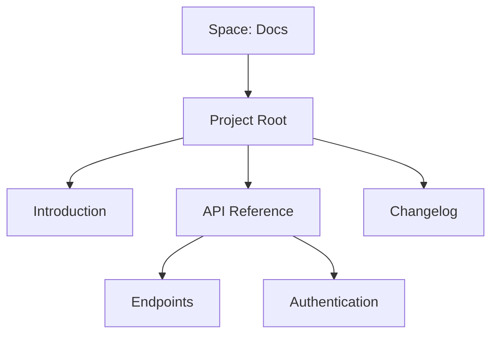

## Overview

am organizes your documentation into flexible spaces that scale with your projects. You manage content through intuitive hierarchies, support multiple content types with built-in versioning, and enable seamless team collaboration. These core concepts form the foundation for efficient documentation workflows.

<Columns cols={3}>
  <Card title="Spaces" icon="layout" href="#documentation-spaces">
    Group related docs into isolated spaces.
  </Card>
  <Card title="Projects" icon="folder" href="#project-structures">
    Build nested structures for complex docs.
  </Card>
  <Card title="Versioning" icon="git-branch" href="#content-types">
    Track changes across content types.
  </Card>
</Columns>

## Documentation Spaces and Organization

Spaces act as top-level containers in am. You create a space for each major project or team, keeping documentation isolated yet interconnected. Each space includes its own navigation, permissions, and settings.

Within a space, you organize pages using folders and subfolders. This mirrors your project's structure, making navigation intuitive.

<Callout kind="info">
  Start with one space per product. Use tags for cross-space linking if needed.
</Callout>

## Project Structures and Hierarchies

Projects within spaces use a tree-like hierarchy. You define parent-child relationships between pages, enabling automatic sidebar generation and contextual navigation.



This structure supports deep nesting up to five levels, with automatic URL generation like `/space/project/page`.

## Content Types and Versioning

am supports multiple content types: Markdown, MDX, and rich embeds. Versioning tracks changes at the page or section level, with semantic tags like `v1.0.0`.

<Tabs>
  <Tab title="MDX Pages" icon="file-text">
    Use MDX for interactive docs with components.
  </Tab>
  <Tab title="Markdown" icon="file">
    Standard Markdown for simple pages.
  </Tab>
  <Tab title="Embeds" icon="link">
    Integrate videos, iframes, and APIs.
  </Tab>
</Tabs>

<CodeGroup tabs="CLI,API">
  ```bash
  am version create my-page --tag v1.2.0 --message "Add auth support"
  ```
  ```javascript
  await am.versions.create({
    pageId: "my-page",
    tag: "v1.2.0",
    message: "Add auth support"
  });
  ```
</CodeGroup>

## Collaboration Workflows

Teams collaborate through real-time editing, reviews, and approvals. Follow these steps to contribute:

<Steps>
  <Step title="Fork Space" icon="git-fork">
    Create a fork for your changes.
  </Step>
  <Step title="Edit Content">
    
    Update pages using the visual editor or MDX.
    
    ```mdx
    ## New Feature
    
    Added support for `{dynamic}` components.
    ```
    
  </Step>
  <Step title="Request Review" icon="eye">
    Submit for peer review with comments.
  </Step>
  <Step title="Merge & Publish" icon="git-merge">
    Merge after approval and publish to production.
  </Step>
</Steps>

<Expandable title="Advanced Permissions" default-open="false">
  Assign roles like Editor, Reviewer, or Admin per space. Use webhooks for external notifications:
  
  ```json
  {
    "event": "page.updated",
    "spaceId": "docs-prod",
    "webhookUrl": "https://your-webhook-url.com/webhook"
  }
  ```
</Expandable>

<Callout kind="tip">
  Integrate with GitHub for version sync. See [Quickstart](/quickstart) for setup.
</Callout>