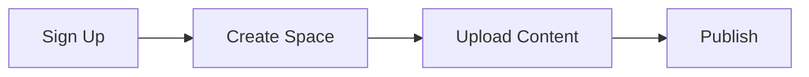

## Prerequisites

<Callout kind="info">
Before starting, ensure you have:
- A modern web browser (Chrome, Firefox, or Safari)
- An email address for account verification
- Optional: A GitHub account for version control integration
</Callout>

## Create Your Account and First Project

Follow these steps to get up and running with am. The entire process takes less than 5 minutes.

<Steps>
  <Step title="Sign Up" icon="user-plus">
    Visit [https://app.am](https://app.am) and click **Sign Up**.

    Fill in your email, password, and display name. Verify your email via the confirmation link sent to your inbox.
  </Step>

  <Step title="Log In and Create Space" icon="log-in">
    Log in with your credentials.

    Click **New Documentation Space** and enter a name like `My Project Docs`. Select a starter template such as "Empty" or "Basic MDX".
  </Step>

  <Step title="Configure Basics" icon="settings">
    In your new space dashboard, set your brand color to `#3B82F6` under **Space Settings > Theme**.

    Enable public access if needed via the toggle.
  </Step>
</Steps>

## Upload Your Initial Content

Add your first documents using one of these methods.

<Tabs>
  <Tab title="MDX Editor" icon="edit-3">
    Click **New Page** in the sidebar.

    Use the built-in editor to write MDX content. Here's a starter example:

````mdx
# Welcome

This is your first page in am.
````
  </Tab>

  <Tab title="File Upload" icon="upload">
    Drag and drop `.mdx` or `.md` files into the **Files** section.

    Supported formats include images, PDFs, and code files up to `10MB`.
  </Tab>

  <Tab title="GitHub Import" icon="github">
    Connect your GitHub repo via **Integrations > GitHub**.

    Select a branch and import directly:

````bash
git push origin main
````

    am syncs changes automatically.
  </Tab>
</Tabs>

## Basic Interface Tour

Explore the main am interface with this overview.

<Columns cols={3}>
  <Card title="Sidebar Navigation" icon="menu">
    Access pages, settings, and integrations. Use search for quick navigation.
  </Card>

  <Card title="Editor Workspace" icon="edit">
    Real-time MDX preview with syntax highlighting. Supports components like `<Callout>`.
  </Card>

  <Card title="Preview Panel" icon="eye">
    Live site preview. Toggle themes and test responsiveness.
  </Card>
</Columns>

## Sample MDX Page

Create a page with components for rich documentation.

<CodeGroup tabs="MDX,Preview">
````mdx
<Callout kind="success">
  Your docs are live!
</Callout>

<Image
  src="https://example.com/screenshot.png"
  alt="am dashboard"
  width="800"
  height="400"
/>
````


</CodeGroup>

## Next Steps

<Callout kind="tip">
Congratulations! Your first documentation space is ready. Dive deeper next.
</Callout>

<Columns cols={2}>
  <Card title="Authentication" icon="shield" href="/authentication">
    Secure your space with API keys and webhooks.
  </Card>

  <Card title="Advanced MDX" icon="code" href="/configuration">
    Master components and custom themes.
  </Card>
</Columns>

<Expandable title="Troubleshooting Common Issues" default-open="false">
- **Email not received?** Check spam folder or resend verification.
- **Upload fails?** Ensure files are under `10MB` and use supported formats.
- **Preview broken?** Clear browser cache and refresh.
</Expandable>